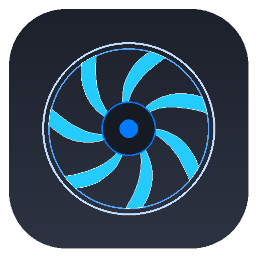
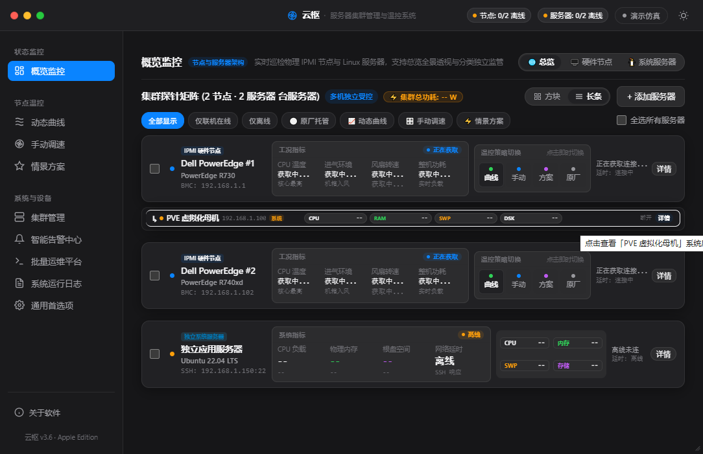
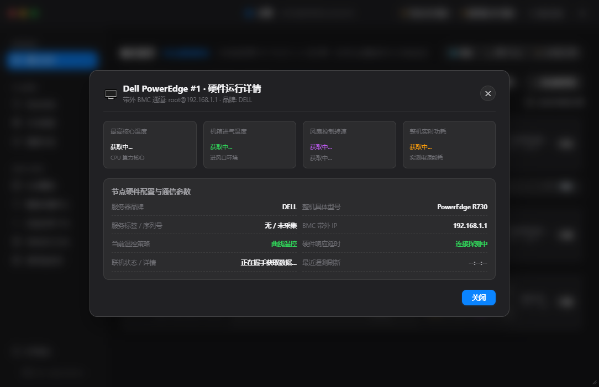
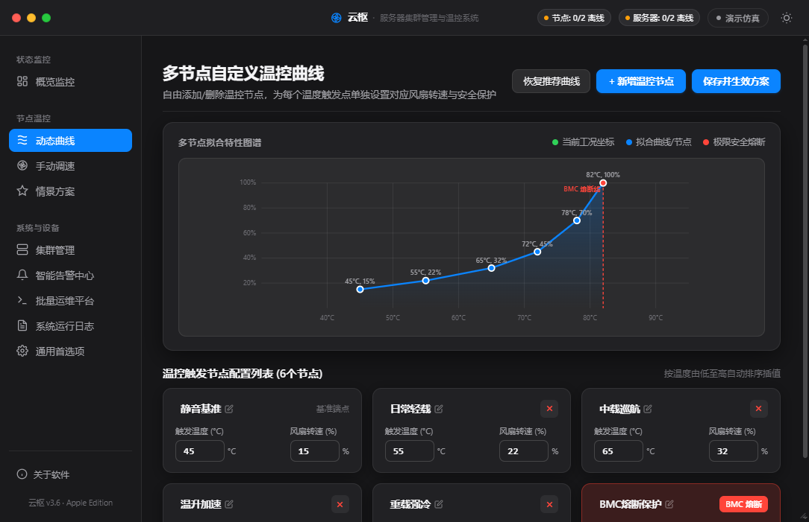
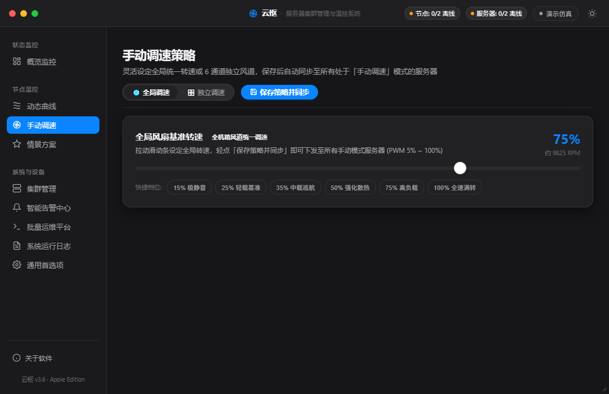

# 云枢 (YunShu) - 多品牌服务器智能温控与混合集群运维中心

<p align="center">
  
</p>

<p align="center">
  <b>专为数据中心、边缘机房与 Homelab 打造的多品牌服务器硬件温控与混合集群运维平台</b><br>
  深植 Apple 工业级人机交互设计标准 (HIG) · 兼容 Dell / Inspur / Huawei / Supermicro / Lenovo 全系硬件<br>
  物理 IPMI 带外温控引擎 ╳ 操作系统内核级 SSH 实时探针 ╳ 毫秒级安全超温熔断闭环
</p>

<p align="center">
  
  
  
  
  
</p>

---

## 🌟 项目简介

在机房运维、企业边缘节点或家庭私有云（Homelab）环境中，Dell PowerEdge、浪潮（Inspur）、华为（Huawei/FusionServer）、超微（Supermicro）、联想（Lenovo ThinkSystem）等服务器以高扩展性与性价比被广泛部署。然而，各大厂商 BMC 原厂自带的散热调度在加装非认证第三方 PCIe 设备（如加速卡、万兆网卡、消费级 GPU）时，常常触发极端保守的高转速风噪（甚至常年 50%~100% 刺耳啸叫）。

传统管理手段多为零散简陋的批处理脚本或单机版工具，缺乏统一集群视盘、系统内实时负载联动及高可用防护。

**「云枢」(YunShu)** 基于现代轻量混合架构打造，以优雅的 **Apple HIG 视觉规范** 为基底，将多品牌带外硬件控制（IPMI 2.0 / DCMI）与操作系统内核心态指标（SSH / Linux / PVE）深度融合，提供兼顾**静音调控、集群巡检、自适应策略及军工级防过热熔断**的一站式开箱即用体验。

---

## ✨ 核心特性

### 1. 纯正 Apple HIG 工业美学
- **深色与浅色双模自适应**：深邃磨砂石墨质感与通透自然光影，支持全局实时平滑切换。
- **全景总览 / 硬件节点 / 系统服务器 三维视界**：顶层单行并列分段器，支持一键切换集群全景透视或专注物理/虚拟层。
- **紧凑方块网格 (Compact Grid) & 贯通长条矩阵 (Compact Row)**：无论窗口如何收缩拉伸，始终保持严密的弹性栅格与无阶跃动画。
- **毛玻璃浮层模态窗 (Modal)**：详情展开采用非侵入式 Apple 浮层弹窗，侧边主菜单始终常驻，支持 ESC、右上角关闭按钮及点击空白区毫秒级收回。

### 2. 多品牌硬件架构深度兼容
- **全系列无缝支持**：
  - 戴尔 **Dell PowerEdge** (12G / 13G / 14G / 15G / 16G 全系 iDRAC 7/8/9)
  - 浪潮 **Inspur** (NF5270 / NF5280 M4/M5/M6 等)
  - 华为 **Huawei** (RH2288 / FusionServer 2288H V3/V5 等 iBMC)
  - 超微 **Supermicro** (X9 / X10 / X11 / H11 / H12 全系 IPMI)
  - 联想 **Lenovo** (ThinkSystem SR650 / RD 系列 TSM/XCC)
- **品牌温控协议自动映射**：自动嗅探服务器品牌型号并适配专属底层控制指令（Raw Byte 命令组精准分发）。

### 3. 四维全时温控策略矩阵
- **动态曲线模式 (Dynamic Curve)**：可视化自由拖拽多段温度-转速拐点。基于实时最高核心温度，毫秒级无级插值调谐转速。
- **全局与独立手动模式 (Manual RPM)**：支持全局多机一键恒定锁定，亦支持 6 通道风扇独立步进调校（5%~100%），调参过程具备输入保护，严防刷新回弹。
- **情景方案模式 (Preset Scenes)**：极致静音、日常均衡、中度负荷、性能全开一键切换，瞬时无缝穿透全集群。
- **原厂托管模式 (Factory Auto)**：一键归还控制权，恢复服务器 BMC 原厂自适应温控算法。

### 4. 操作系统非侵入式 SSH 实时探针
- **Linux / PVE / Debian / Ubuntu / CentOS 深度巡检**：原生异步长连接，零 Agent 代理侵入，实时采集 CPU 算力、物理内存、Swap 换页、磁盘健康度与网络延时。
- **父子节点绑定联动**：支持将系统服务器与物理 BMC 节点绑定为一体化复合卡片，亦可作为独立节点监管。
- **全选与批量并发指令分发**：支持跨节点勾选，一键向数十台服务器分发温控策略或执行批量运维 Shell 命令。

### 5. 极致可靠的生命周期与熔断保护
- **超温熔断自动托管 (Safety Guard)**：当探测到 CPU 温度触及安全红线（默认 82℃，可调）或链路断开时，毫秒级自动唤醒原厂 BMC 全速强冷，确保机架资产零风险。
- **优雅遥测三态生命周期**：
  - 链路探测中：轻量指标显示精致微型「获取中...」；
  - 联机受控：高保真显示实时工况；
  - 确认掉线：**彻底清空指标并显示 `--`**，气泡清晰交代离线根本原因。
- **磁盘优先深度持久化 (Load Inversion)**：全量策略、独立转速、曲线节点、展示模式均永久写入 `config.ini`，版本更新与重启绝不丢失用户自定义。
- **多渠道全天候告警引擎**：深度集成通知中心，支持企业微信、钉钉、飞书、Server酱、Bark、PushPlus 消息推送及本地音频/TTS 语音警报。

---

## 🖥️ 界面预览

| 概览全景矩阵 (深色模式) | 节点详情毛玻璃模态窗 |
|:---:|:---:|
|  |  |

| 动态自适应温控曲线 | 多通道与全局手动调速 |
|:---:|:---:|
|  |  |

---

## 🚀 快速上手

### 方式一：下载开箱即用独立可执行程序 (Windows 推荐)
无需安装 Python 环境或额外依赖，直接下载单文件便携版运行：

1. 前往本仓库 [Releases 页面](../../releases) 或项目根目录下载 **`云枢.exe`**；
2. 双击直接运行（配置与日志将自动保存在程序同级目录的 `config.ini` 与 `logs/` 下）；
3. 支持设置开机静默启动、托盘最小化与后台守护运行。

---

### 方式二：从源码构建与跨平台运行 (Windows / macOS / Linux)

#### 1. 环境准备
确保已安装 Python 3.10 及以上环境：
```bash
git clone https://github.com/kongbai9420/YunShu.git
cd YunShu
python -m venv venv

# Windows 激活虚拟环境
.\venv\Scripts\activate

# macOS / Linux 激活虚拟环境
source venv/bin/activate
```

#### 2. 安装依赖
```bash
pip install -r requirements.txt
```
*(主要依赖包括 `pywebview`, `paramiko`, `cryptography`, `bottle`, `pythonnet` 等)*

#### 3. 启动应用
```bash
python src/app.py
```

#### 4. 打包为单文件可执行程序
- **Windows (生成 `云枢.exe`)**：
  ```bash
  python build_exe.py
  ```
- **macOS / Linux**：
  ```bash
  bash build_mac.sh
  ```

---

## ⚙️ 配置文件说明 (`config.ini`)

程序首次启动会自动生成标准配置文件 `config.ini`。用户所做的所有修改（服务器列表、转速偏好、曲线控制点、告警渠道配置等）均会自动持久化回写至该文件：

```ini
[ipmi]
active_server_id = srv_primary
dashboard_view_mode = probe
probe_layout_style = compact_grid
ui_refresh_sec = 1
auto_refresh_sec = 3
manual_speed = 25
preset_key = silent
mode = auto

# 极速优化引擎开关 (默认全部开启)
opt_dcmi_temp_enabled = 1
opt_sdr_cache_enabled = 1
opt_cipher_suite_enabled = 1
opt_fast_retransmit_enabled = 1
opt_type_filter_enabled = 1
opt_keepalive_session_enabled = 1

[cluster]
# 保存已配置的物理硬件节点与系统服务器列表 (JSON 序列化存储)
servers_json = [...]
system_servers_json = [...]

[alert]
enabled = 1
node_cpu_temp_enabled = 1
node_cpu_temp_threshold = 80
webhook_type = dingtalk
webhook_url = https://oapi.dingtalk.com/robot/send?access_token=...
```

---

## 🛡️ 安全合规说明

1. **凭证隔离与内存保护**：BMC 访问密码与 SSH 私钥仅在建立加密隧道时临时读取，绝不在日志或非受信网络通道明文暴露；
2. **非阻塞安全管道**：带外通信与 SSH 探测均运行在独立的后台隔离守护线程，即使特定节点网络中断，主界面交互与温控监控线程亦绝不卡顿或闪退；
3. **出厂级硬件熔断底线**：任何极端情况下（如探针异常退出、CPU 温度突增超越安全线），内核安全钩子均会自动下发 BMC 控制权归还指令，严防设备因软件故障导致硬件受损。

---

## 👨‍💻 作者与社区交流

- **作者**：[空白色不语](https://github.com/kongbai9420)
- **官方 QQ 交流群**：**`317151818`**（欢迎加入探讨 Homelab 硬件改造、温控调优与服务器运维心得）
- **技术支持**：基于 Python + PyWebview + Paramiko + IPMI 2.0 标准构建
- **设计规范**：严格遵循 Apple Human Interface Guidelines (HIG) 设计标准

---

## 📄 开源许可证

本项目基于 [MIT License](LICENSE) 协议开源。欢迎提交 Issue 与 Pull Request 共同完善多品牌服务器运维体验！
